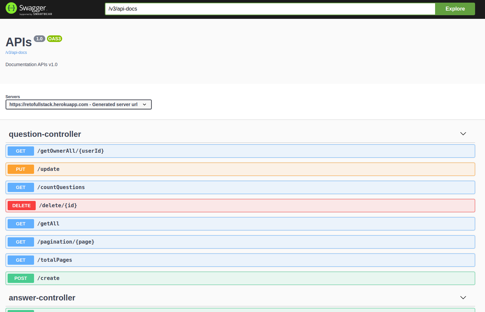
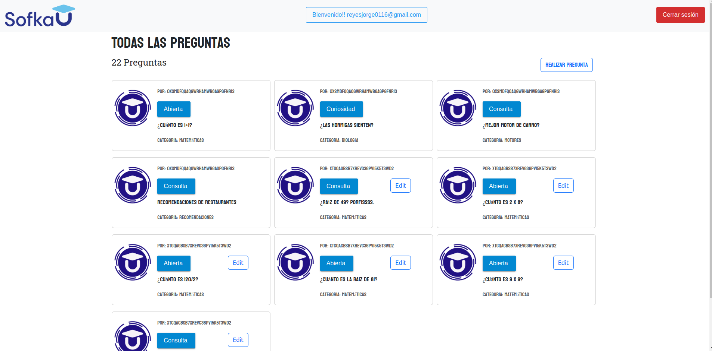

# Reto-final-web-intermedio
Reto final para las training leagues de Sofka U. Angular con firebase y spring con mongo y depsliegue en heroku.

Jorge Steven Reyes

Dimar Andrey Suarez

## Despliegue:

Backend Heroku: https://retofullstack.herokuapp.com/

Swagger Heroku: https://retofullstack.herokuapp.com/webjars/swagger-ui/index.html

Frontend Firebase: https://reto-full-stack.web.app/preguntas

## Caracteristicas desarrolladas:

| CARACTERÍSTICA                               | NOTA                                                     | PUNTOS |
| -------------------------------------------- | -------------------------------------------------------- | ------ |
| Consumo del back-end  actual                 | OK                                                       | 5      |
| Uso adecuado de rutas                        | OK                                                       | 5      |
| Logueo usuario/contraseña                    | OK                                                       | 5      |
| Autenticación de Gmail                       | OK                                                       | 5      |
| Restablecer contraseña                       | OK                                                       | 15     |
| Sistema para calificación de las respuestas. | Cumple con los requerimientos menos el promedio          |        |
| Editar respuestas                            | Se implemento en el backend pero no en el front          |        |
| Scroll infinito de respuestas                | OK                                                       | 25     |
| Páginador de Preguntas                       | OK                                                       | 20     |
| Uso adecuado de Observables en Angular       | OK                                                       | 20     |
| Uso de algún frameworks o preprocesador CSS  | OK                                                       | 10     |
| Uso de Swagger                               | OK                                                       | 20     |
|                                              | TOTAL sin los dos requerimientos que no quedaron al 100% | 130    |

